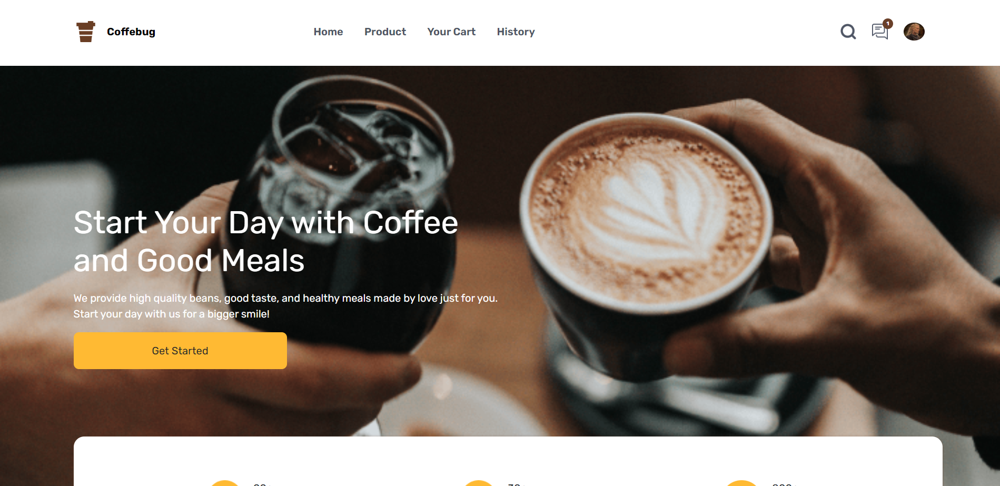
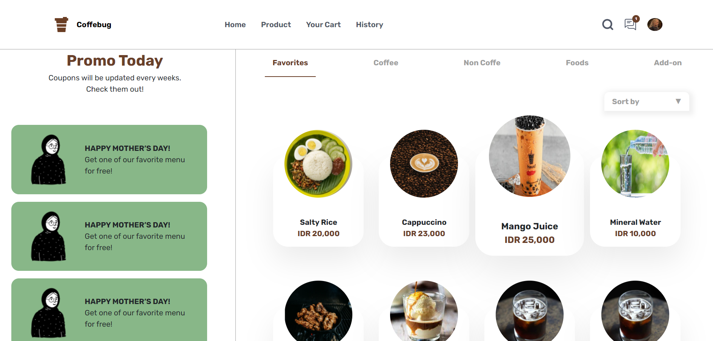
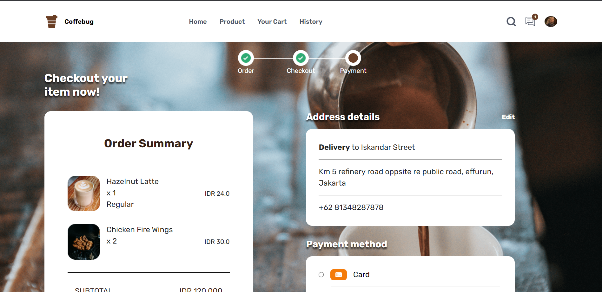
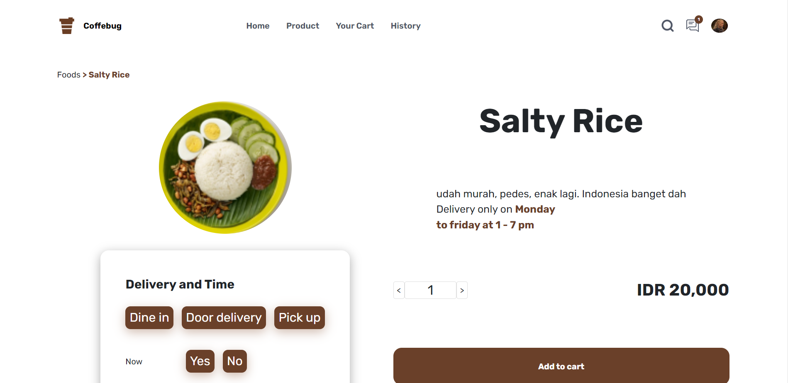
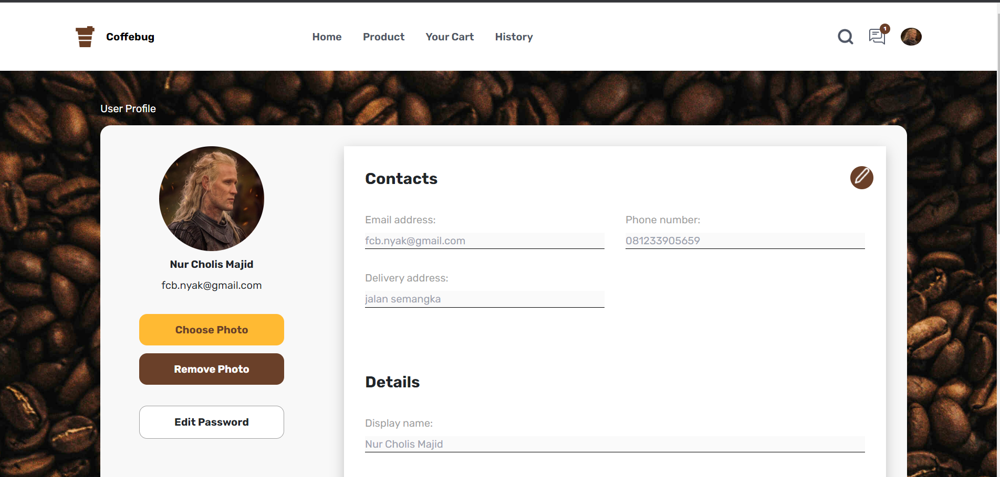

# <div align="center"> Coffebug </div>

<div>

<p align="center">
  <a href="https://skillicons.dev">
    
  </a>
</p>

<br/>
Coffebug is a web application that sells foods, coffee, and beverage. with this application, customers can order more easily from coffee shop.
</div>

## Contents

- [Features](#features)
- [Run Application](#how-to-run-the-application)
- [Deployment](#deployment)
- [Screenshots](#screenshots)
- [Related Projects](#related-projects)
- [Authors](#authors)

## Features

### Customer

- Auth
  - Login
  - Logout
- User
  - Register
  - Forgot Password
  - Edit Profile
- Product
- Promo
- Transaction

### Admin

- Auth
  - Login
  - Logout
- User
  - Forgot Password
- Product
  - Add Product
  - Edit Product
- Promo
  - Add Promo
  - Edit Promo
- Transaction
  - Edit Transaction

## How to Run the Application

### 1. Clone this repository

Clone this repository by run the following code:

```
$ git clone <this-repo-url>
```

### 2. Install dependency packages

Install dependency packages by run the following code inside project folder:

```
$ npm install
```

### 3. Configure .env file

Configure .env file by create file named .env inside project folder and add this line to the file:

```
NEXT_PUBLIC_BACKEND_URL = "https://coffebug.vercel.app/api"
```

### 4. Run projects

Run this projects by run the following code:

```
$ npm start
```

It runs the app in the development mode.\
Open [local host](http://localhost:3000) to view it in your browser.

The page will reload when you make changes.\
You may also see any lint errors in the console.

## Deployment

[Vercel deploy link](https://coffebug-online.vercel.app/)

## Screenshots

<div align="center" style="display:flex flex-wrap:wrap">
       
    
    
    
    
    
</div>

## Related Projects

- [Coffebug Backend](https://https://github.com/mindkeeper/coffebug)
- [Coffebug Mobile](https://github.com/mindkeeper/coffebug-react-native)

## Authors

[@Nur Cholis Majid](https://github.com/mindkeeper)
